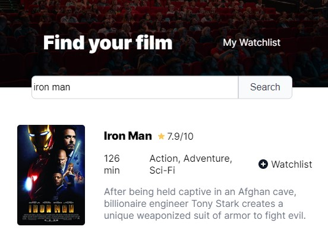

# Movie Watchlist

[Scrimba](https://scrimba.com/)'s solo project. The goal of this project was to create an app to fetch movies from an API and save the selected ones into a watchlist.

## Preview

## Project walkthrough

1. Type a search term and then click on Search.
2. To save a movie to the watchlist click on "+ Watchlist".
3. Click on My Watchlist to change to the watchlist page where saved movies are displayed.
4. To remove a movie from the watchlist click on "- Remove".
